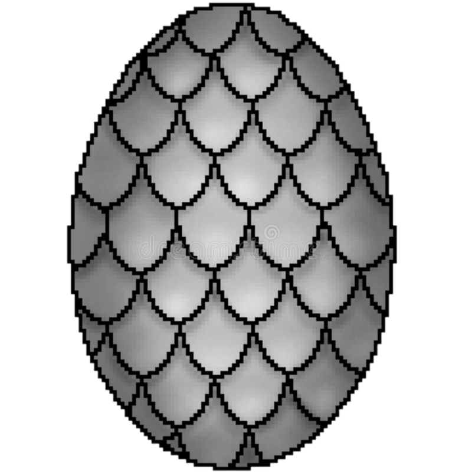

Welcome to the Final Iteration of Caitlyn Franke's final project website - Strix Egg Emporium!

This site is meant to act as a store where an individual can buy "dragon eggs". While the entire site is built with static files (barring the relation to javascript and the navigation bar) it is built with the intention of allowing a glance into how the site would work with such things as a log-in system, carts of items, orders, and invoices.

This instance had the sizing for different screen sizes placed in, which mean a lot of code changes to use a vw sizing option instead of px. Back end has been cleaned up with alt tags on images and ensuring the presence of language tags.

I've learned that Github doesn't like submits used with posts, and will give a "405 - Not Allowed Error" so all of my submits have been changed into buttons with an onclick attribute, which also breaks all "you can't move on without filling in this field" instances I have.

I also don't have any form of database so I had to mock up static html examples of what the site might show. There is a lot of features that this site can't actually use (like the search) because everything is static.

Enjoy your browsing!

