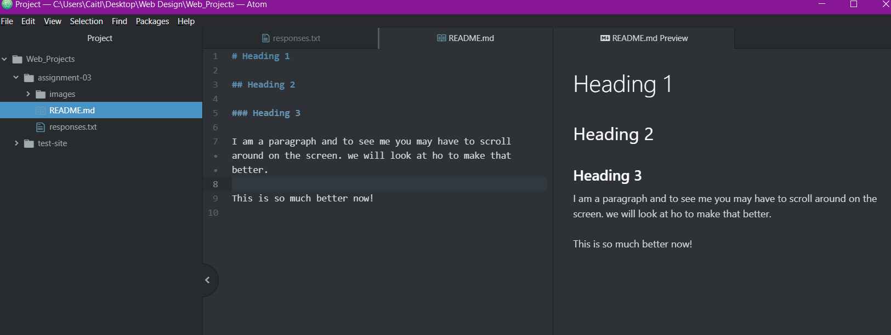

# Heading 1

## Heading 2

### Heading 3

I am a paragraph and to see me you may have to scroll around on the screen. we will look at how to make that better.

This is so much better now!

1) Learned how to make this above data be previewed and more user-friendly to read in Atom editor.
2) Learned how to make Reletive links.
3) I've learned more about design related info, for Web sites, than the minimum I knew from my web development classes.

[My Responses](.responses.txt)

