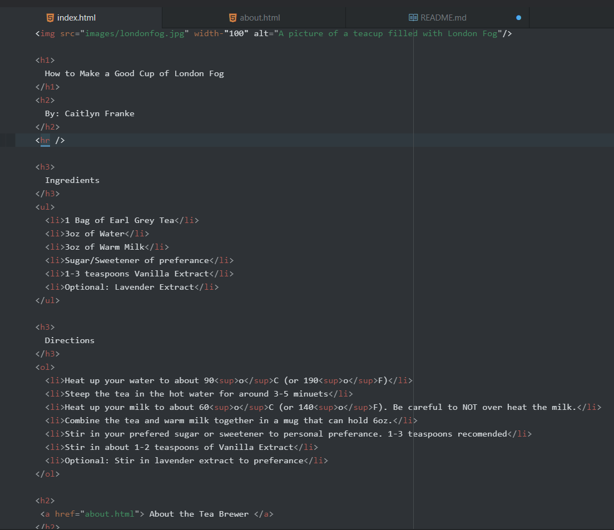
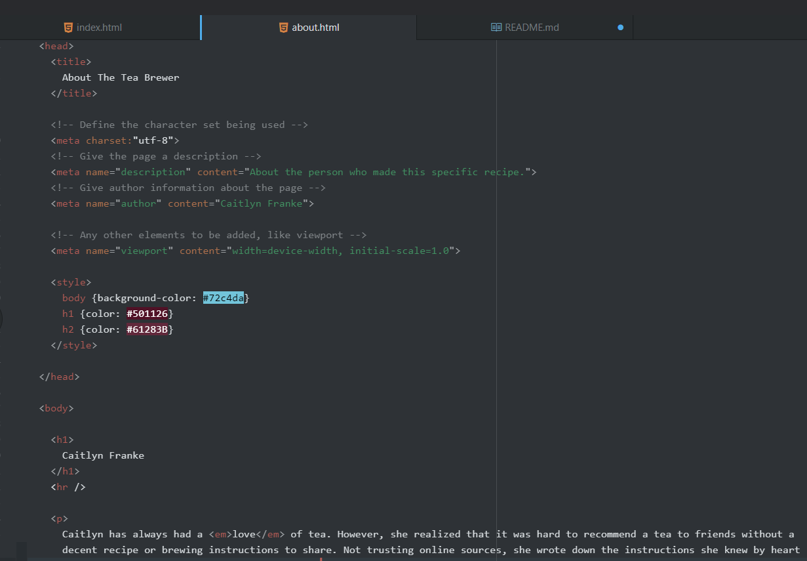

Please describe the difference between semantic and structural markup.

Structural markup is one that helps you know the structure of the page layout. It's like scaffolding for building the rest of the page. A < br / > will tell you that you're going to the next line, and edits the page structure.

Semantic markup indicates that you're changing something about the content. Like how using a < em > < /em > will change a small portion of the text, giving it more context and 'meaning'.

