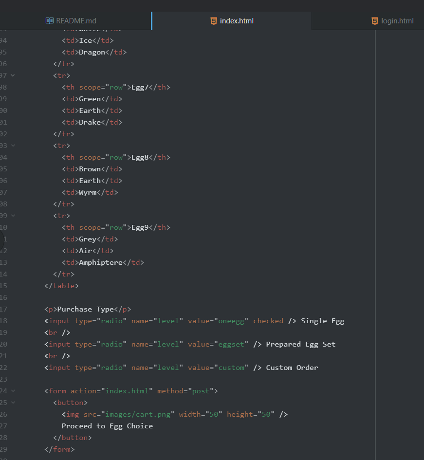
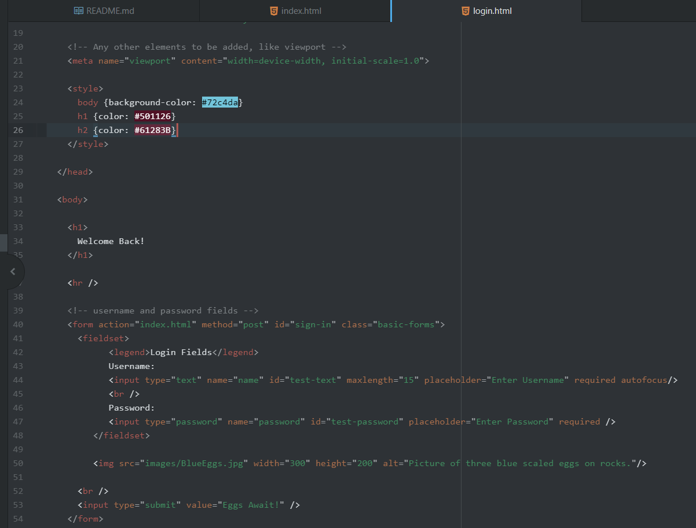

Please describe any forms you've come across while browsing the web. What purposes do they serve?

I've had a lot of time seeing various forms on the internet, but the most common are the login ones.
They got buttons, text fields, upload sections, checkboxes, and other unique little interaction features.
Literally their goal (of a login site) is to stop you for a bit, ask for some identifying information, so it can either log you in or create you a new account. They work in a way that is meant to be user friendly, but also restricting to make sure you're not trying to break the site with various naughty online activity.

Forms just help create a better interaction with the user, while also limiting the options they can have (in a good way).

