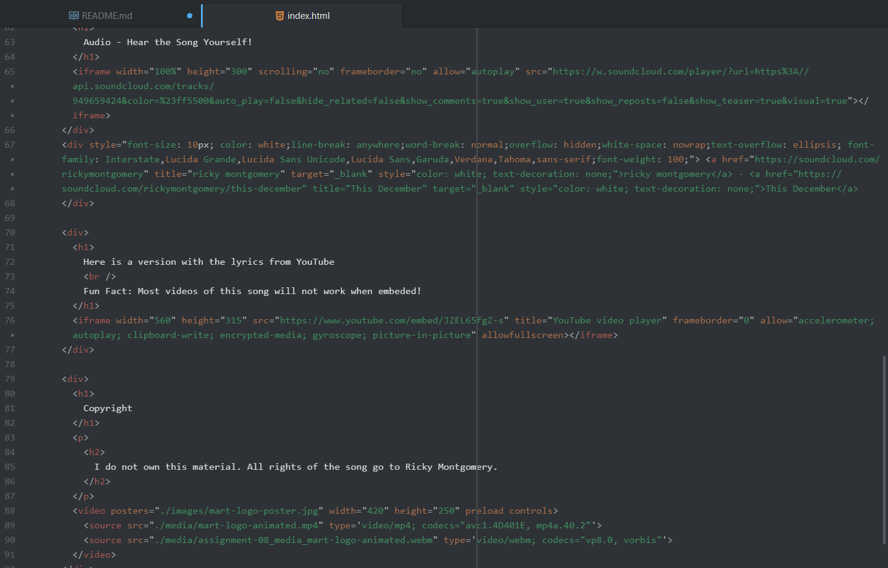

What is an affordance?

An affordance is everything that an element can do. Like in what ways will a user be interacting with said elements. Say pressing a button to move onto the next bit of information, or to help in navigating around a site, or to mute said site.

---------------------------------------

What are the advantages and disadvantages of using a third-party service like YouTube or Vimeo to host your videos?

Advantages include not having to store the data for whatever material you need, and it's "quality" should be managed by the third-party. Like how a YouTube video will remain up hosted on YouTube's resources, shouldn't have issues, and likely will still have any options that a video on YouTube would always have. Disadvantages include the fact that you lose a certain amount of control over what you can do with a file. YouTube might say that you can't view the video anywhere but their own site suddenly, or the video might be outright deleted meaning your code is no longer referring to something that exists.

-------------------

Optional: What challenges did you face this week with this assignment? How did you overcome them?

For a while, my style code wasn't working. Specifically the div element styles did not want to apply themselves to any of the div elements. This was somehow fixed when I played the div code about the code styling the headers with color. So it works now, though I know nothing of why it broke and why it was fixed.

--------------------

