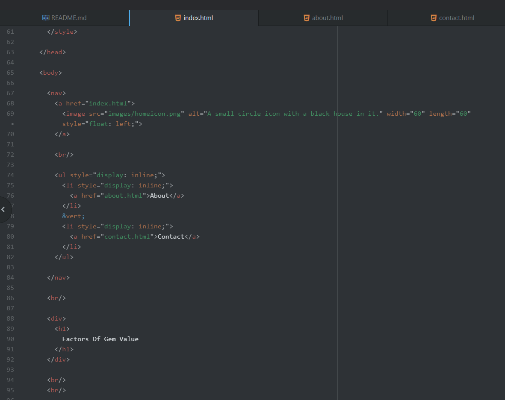

Briefly recap your experience learning HTML. What was old, new, interesting, or difficult to learn?

I suppose this depends on what start in learning you mean. I've had a LOT of experience with html in all reality. Even way back when I was a young kid playing Neopets, and was getting into the html source code to find the number I needed to make a mini calculation for a puzzle. More recently I've done several web development classes as well. First was very close to the guidelines, fully relying on Django to do some of the heavy lifting. That made it harder for my second class which required me to throw a lot of the previous knowledge in the memory storage and start learning how to make an html page from scratch. As a expected it took time to understand the new language. Eventually I had an entire website, linked to a database, that one could freely navigate and interact with. Coming into this class, a lot of the basic structure code is old for me, but the intricacies of cleanly styling things or putting in videos is entirely new. It's odd to learn website code that isn't always just memorizing all the structure aspects, and more understanding how to put things together after choosing what style you might want.

--------------------

After we come back from spring break we will start to dive into CSS and expand on styling, which helps us "decorate" HTML. Is there anything you're anxious or excited to learn about in this new section?

I'm honestly really excited to learn about better website styling in general. I've done a lot of work in extensive basic html and php related work, but only really have worked in the bear basics of css coding. A color here, sizing there, and all that jazz. I really want to learn what tricks can make a website look more professional. Maybe things similar to putting the images behind the main bulk of the content without killing readability. Like how the div color made a central area, but with more stylized imagery rather than single-color blocks.

--------------------

