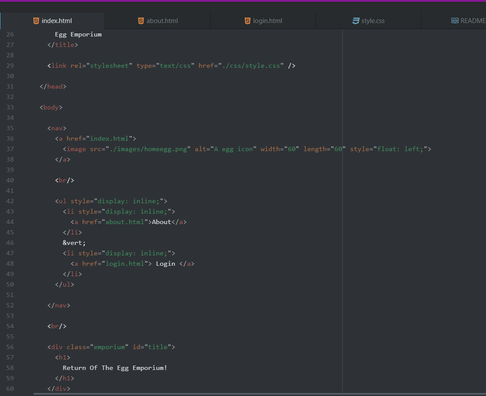
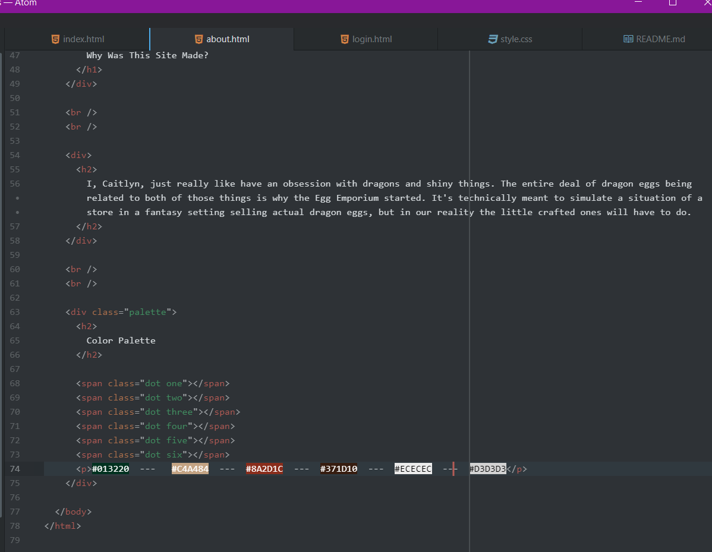
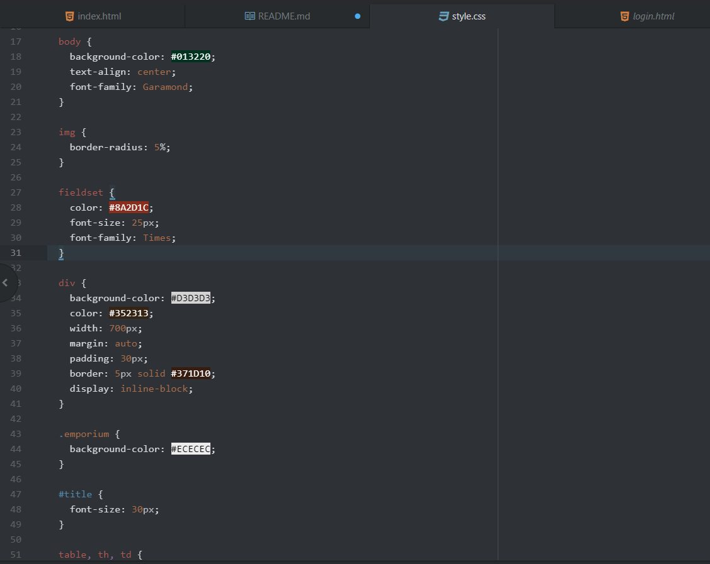

Describe the difference between the universal, element, class, and id selector types. When might you choose one over the other to style content?

Universal is applied to every element on your page (is a *). Element will only effect all elements of a specific type (like div or table). Class will only effect elements that have the class attribute attached to them (defined by the . symbol). ID will only effect elements that have the id attribute attached to them (defined by the # symbol).

--------------------

Discuss your color palette. How did you choose your colors?

My color palette is mostly Dark Green, and various Browns, with a touch of Light Grey. I started with the dark green because it wasn't alarming to the eye to have as a background color, and it reminded me of a forest. So to continue a forest theme I picked out browns and greys to be the bark and stones to match the evergreen background.
It kind of matches the feel I wanted which is that of a shop in some forest where you would go shopping for magic eggs.

--------------------

Optional: discuss any challenges you faced this week, and how you overcame them.

Occasionally random style elements would just decide to not work. I either decided to style the page a different way, or found the solution (like in situations that I made a spelling error in the css file).

--------------------

