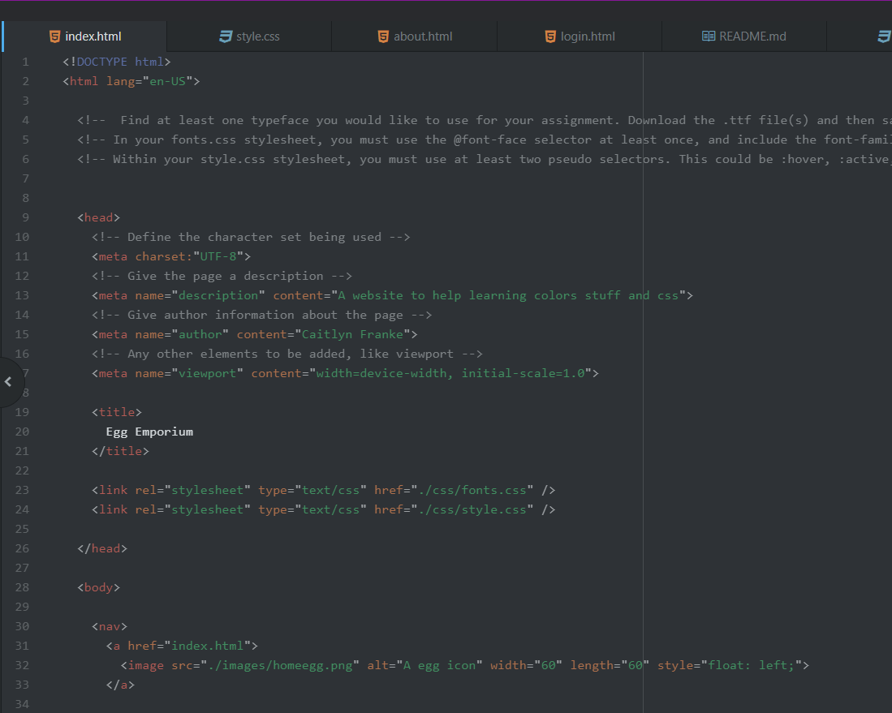
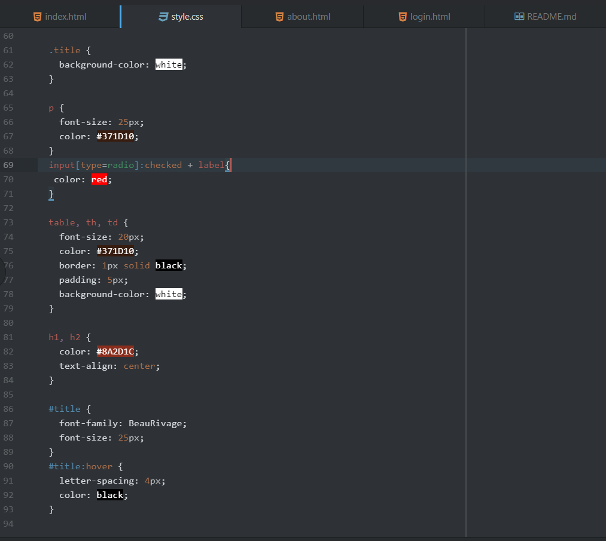
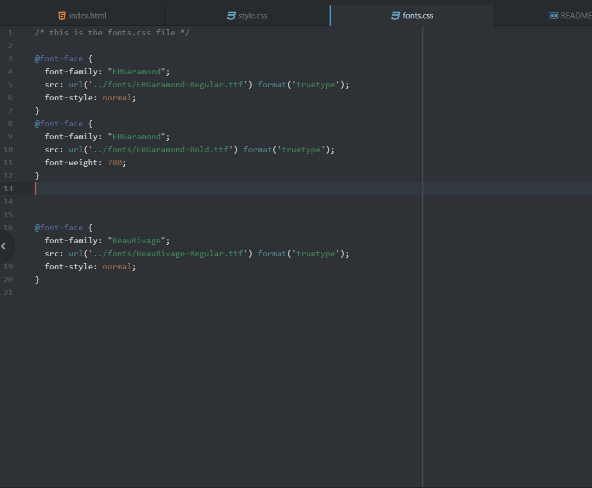

What is typography?

It is a technique that commonly is depicted to be both an art and science, that deals in arranging things to make sure written content is legible, readable, and appealing for when it's displayed. It works a lot with the look and organization of textual information, and presenting it in a way that is user-friendly.

--------------------

What is the importance of having fallback fonts or a font stack?

There is a lot of unique symbols that the human language and text forms have acquired. Many of which might be found amidst things like Unicode characters. Not all fonts know how to deal with these characters. In the situation that a used font doesn't know how to display a character, it can instead rely on symbols found within a fallback font instead.
That makes it very important to have fallback fonts, to help make sure that things on your page don't start to severely break after encountering an unexpected symbol.

--------------------

What is the difference between a system font, web font, and web-safe font?

System fonts are ones that can be found on ones local device and system, and while they are available on your system, it isn't guaranteed to be found on the web.
Web fonts are located on websites, and are not usually found on the system one runs. While they don't need to be directly available on ones device, they will require various elements in order to actually appear correctly.
Web-Safe fonts are the fonts that a developer can count on being available on the system. Being things like Times New Roman or Arial

--------------------

