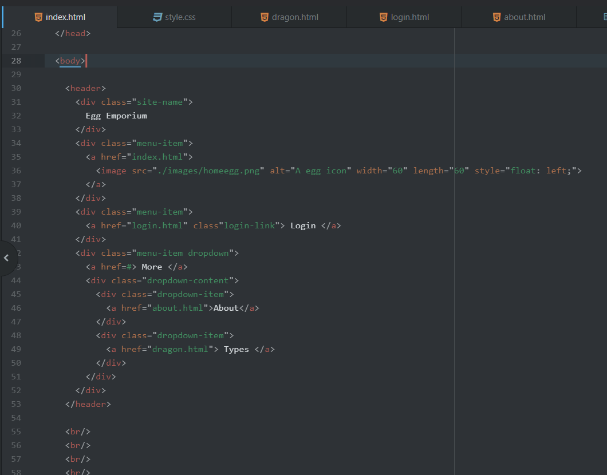
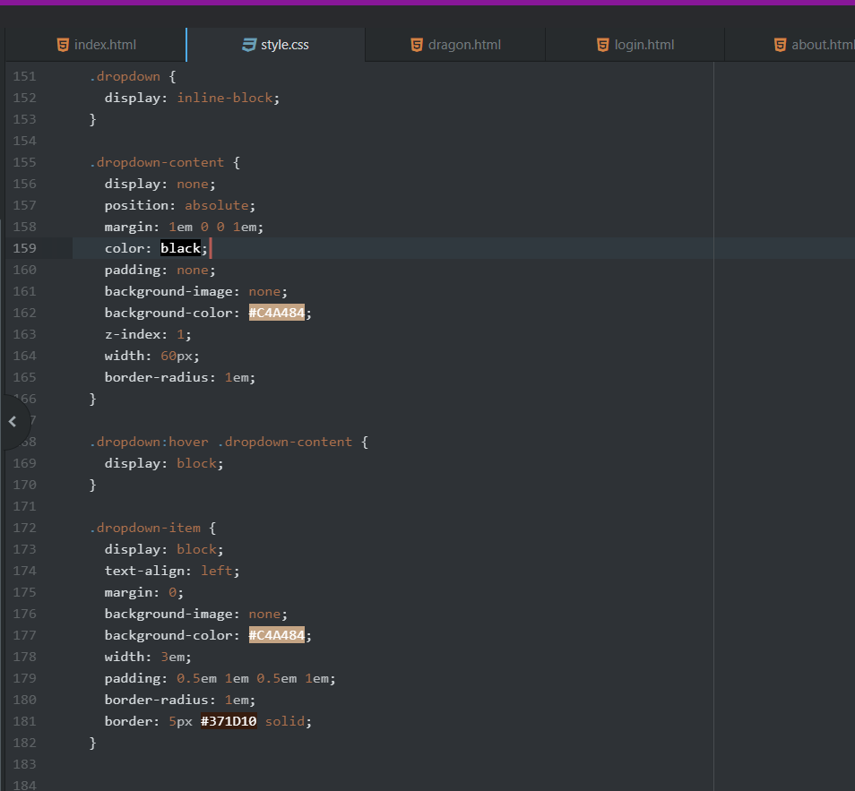

What is the difference between padding, margin, and borders?

Padding is a set amount of space between the inner/center content of an element and the actual element. Say a bit of text within a div, it's the space between the text and the edge of the div element.
Margin is a set amount of space between an element/box and another element (or the edge of some parent element). Works to help define the spaces that aren't related directly to the inner content of an element. Can be left to auto to help center things.
Boarders are a direct edge of something. Like how the outer edge of a div element can have a boarder that will help to specify the outline of it's entire space, kind of being a visual style tool more than actual spacing of objects. It also can be separately colored with many style options.

--------------------

Optional: how did this week's assignment go? What challenges did you face, and how did you overcome them?

I got a little mad at the header element. It didn't want to work with me (janky positioning, things not aligning, margins not working, etc). In light of that I went forth and made a nav element bar of equivalent look and function and placed them on the rest of my pages. I realize I'm supposed to have the header at the top of EACH page, but hopefully it's realized I put one I preferred instead on non-index pages (which has it because class requirement).

--------------------

