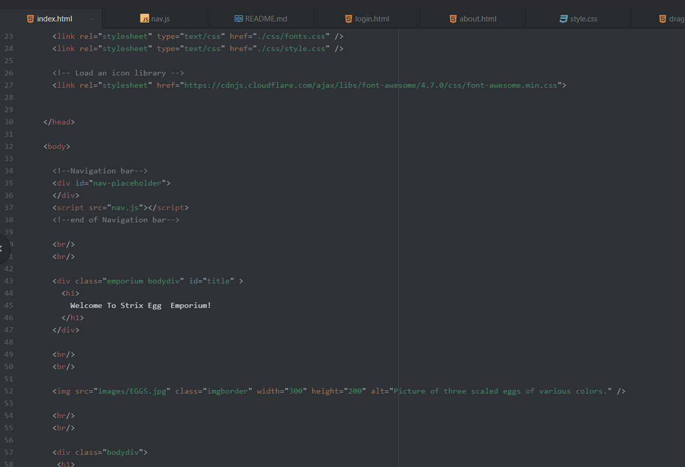
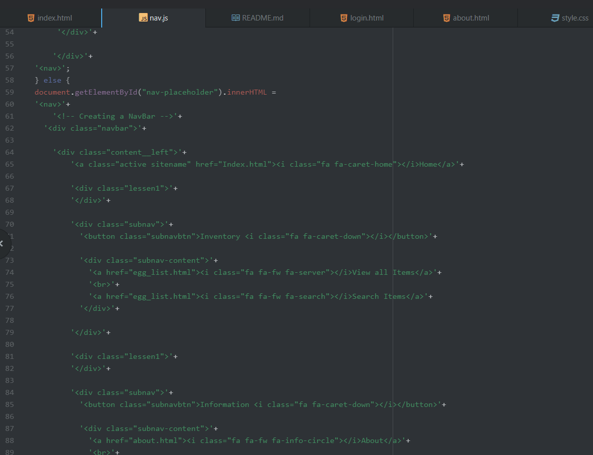

What is the goal of your website? (Think in terms of your user -- why might they visit your site?)

The technical goal of my site is to be a store. I'm "selling" Dragon Eggs, as you've might have seen from the Egg Emporium from the past. It should have a more fantasy vibe, without hindering a shopping experience. Meaning I need a list of inventory, a form of login system (even if not truly functioning with pure static pages), I need likely a cart of sorts, order page, etc. I want it to be functional, but not too simple looking.

--------------------

Why is responsive web design important?

One of the main benefits of RWD is that it simply makes the user experience easier and better. It can improve readability of the site, or even just make sure a site doesn't break by using it via a different machine (PC vs mobile vs tablet deal). It really just makes design of the page not bothered by extreme resizing and stretching of it.
Emphasizes “mobile first, with unobtrusive javascript, and progressive enhancement”

--------------------

